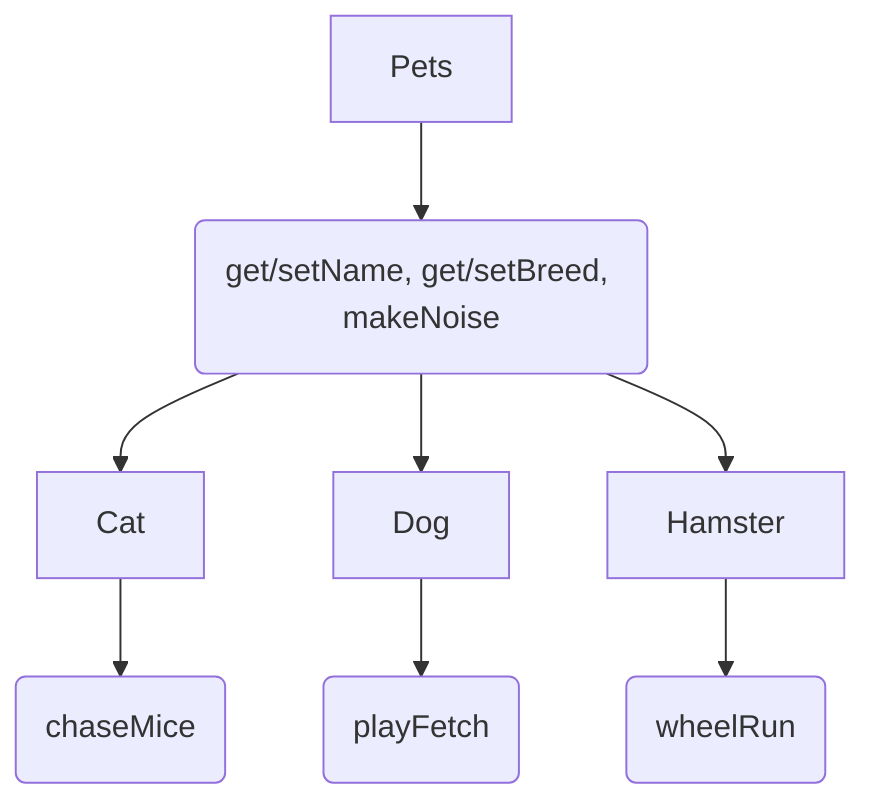

# Lab04PetStore
Inheritance/overwriting Application Lab

Model for Inheritance (Where the curved boxes represent are the functions and the square boxes are the classes)

//getters/setters for name and breed--these are simply inheritted by other classes

//makeNoise -- to be overwritten

//each animal gets at least one special task that it can do--dogs fetch, cats chase mice, hamsters run on wheels

//Maybe they have to make a function for main that generates an array list of pets or something

//Either that or maybe cat uses array lists/regular arrays to store mice it has caught

TODO:
1. override makeNoise for each class to return "Meow", "Bark", and "Squeak" accordingly
2. Write playFetch
3. Write chaseMice
4. Write wheelRun
5. Cats have a secondary name for when they misbehave. Make a class variable for Cat called "badName" and add it to the cat constructor. Override getName() for cat to return "[name] aka [badName]"
